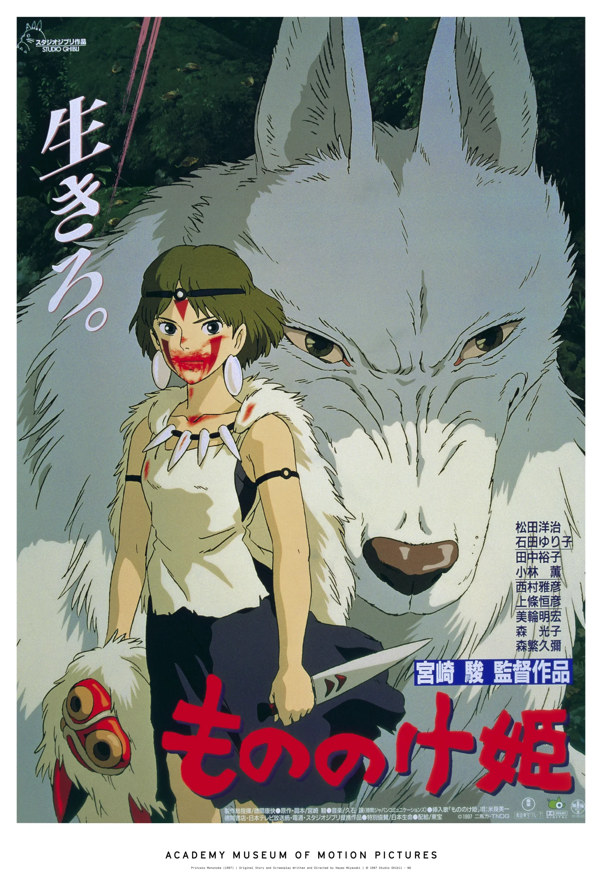

# Kodiliose Franklyn Emelue

### Welcome

I'm a teacher, and a software engineer. I was inspired to become a programmer because of the interests in gaming and science fiction I had growing up, and I've been programming professionally for about five years. 

### Skills

### Projects

### About Me

I also enjoy:
- Writing
- Producing and remixing music
- Eating Good Food
- Traveling 
- Gaming (Mostly story driven games and Action RPGs)
- Attending concerts and festivals
- Reading Manga
- Science Fiction, especially when it features cyberpunk and solarpunk content
- Wordplay, puns, corny jokes

Some of my favorite movies are:
1. Princess Mononoke (1997)
     
    

2. The Lord of the Rings: The Two Towers (2002)    
    (*specifically* because of the music that plays at the battle for Helm's Deep)
3. GATTACA (1997)
4. The Fantastic Mr. Fox (2009)
5. Devil in a Blue Dress (1995)
6. The Tragedy of MacBeth (2021)

[My Spotify](https://open.spotify.com/artist/2uLTlLeaLY9eeotC7S4ggl?si=C80iAh1tS2mnCwB5goVT2Q)
[My Soundcloud](https://on.soundcloud.com/uLh2ir090mxitCfvVl) 
